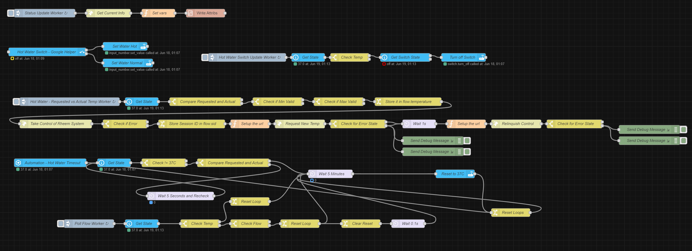
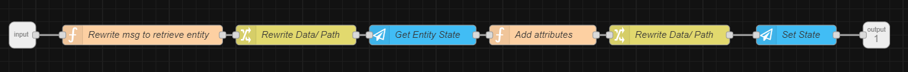

# Home Assistant

Currently, I am using the Node-Red addon to make this work with Home Assistant.

## Working Theory

The below code creates 3 HA entities:

- `input_number.hot_water_temperature`: This is used to set the desired hot water temperature. The code also injects the following custom attributes: `flow` which is the current flow of hot water in L/min and `temp` which is the currently set hot water temp.
- `switch.hot_water`: This is an on/off switch which switches between 37C and 50C. Not strictly necessary but google assistant and siri cannot handle `input_number` so this is a workaround.
- `switch.automation_hot_water_timeout`: This switch enables/ disables the automatic safety timeout. After 5 minutes of inactivity the hot water will revert to 37C. This is designed to avoid the situation where after setting a higher temperature you inadvertently scald yourself in the shower (especially important with young children with sensitive skin or where your hot water heater is capable of achieving more than 50C - strictly this should only be in a corporate environment).

## In Home Assistant

Create an `input_number` helper called `input_number.hot_water_temperature`. It should have the following attributes:
````
initial: 37
editable: true
min: 37
max: 50
step: 1
mode: slider
unit_of_measurement: °C
icon: mdi:kettle-steam-outline
friendly_name: Hot Water Temperature
````

## In Home Assistant Lovelace (Optional)

I am using the HACS custom card `multiple entity row` to display the flow and current temperature in lovelace neatly.

````yaml
type: entities
entities:
  - entity: input_number.hot_water_temperature
  - entity: input_number.hot_water_temperature
    type: custom:multiple-entity-row
    name: Status
    show_state: false
    icon: mdi:water-pump
    entities:
      - attribute: flow
        name: Flow
        unit: L/min
      - attribute: temp
        name: Current Temperature
        unit: °C
````

## Node-Red Flow

Import the following flow into Node Red - do not forget to configure the IP addresses and the HA API integrations as relevant for you.





```` { .json .copy }
[{"id":"3c93a6b23de0cde5","type":"subflow","name":"Write Attribs","info":"","category":"","in":[{"x":80,"y":80,"wires":[{"id":"6cf5b5283c883d03"}]}],"out":[{"x":1360,"y":80,"wires":[{"id":"cb3efa2e16ec5b57","port":0}]}],"env":[{"name":"path","type":"str","value":""}],"meta":{},"color":"#DDAA99"},{"id":"cb3efa2e16ec5b57","type":"ha-api","z":"3c93a6b23de0cde5","name":"Set State","server":"XXX","version":1,"debugenabled":false,"protocol":"http","method":"post","path":"","data":"","dataType":"json","responseType":"json","outputProperties":[{"property":"payload","propertyType":"msg","value":"","valueType":"results"}],"x":1240,"y":80,"wires":[[]]},{"id":"3eea47eb5abc1b38","type":"ha-api","z":"3c93a6b23de0cde5","name":"Get Entity State","server":"XXX","version":1,"debugenabled":false,"protocol":"http","method":"get","path":"","data":"","dataType":"json","responseType":"json","outputProperties":[{"property":"payload","propertyType":"msg","value":"","valueType":"results"}],"x":680,"y":80,"wires":[["3e5395467e4b5d0e"]]},{"id":"6cf5b5283c883d03","type":"function","z":"3c93a6b23de0cde5","name":"Rewrite msg to retrieve entity","func":"msg.payload = { \"path\": \"/api/states/\" + msg.entity };\nreturn msg;","outputs":1,"noerr":0,"initialize":"","finalize":"","libs":[],"x":260,"y":80,"wires":[["405c70f051b285ee"]]},{"id":"3e5395467e4b5d0e","type":"function","z":"3c93a6b23de0cde5","name":"Add attributes","func":"for(let item in msg.attributes){\n  msg.payload.attributes[item] = msg.attributes[item]\n}\n\nreturn msg;","outputs":1,"noerr":0,"initialize":"","finalize":"","libs":[],"x":860,"y":80,"wires":[["2dc5570020e5fd44"]]},{"id":"2dc5570020e5fd44","type":"change","z":"3c93a6b23de0cde5","name":"Rewrite Data/ Path","rules":[{"t":"set","p":"payload.data","pt":"msg","to":"payload","tot":"msg","dc":true},{"t":"set","p":"payload.path","pt":"msg","to":"path","tot":"global"}],"action":"","property":"","from":"","to":"","reg":false,"x":1050,"y":80,"wires":[["cb3efa2e16ec5b57"]]},{"id":"405c70f051b285ee","type":"change","z":"3c93a6b23de0cde5","name":"Rewrite Data/ Path","rules":[{"t":"set","p":"path","pt":"global","to":"payload.path","tot":"msg"}],"action":"","property":"","from":"","to":"","reg":false,"x":490,"y":80,"wires":[["3eea47eb5abc1b38"]]},{"id":"0696dd904aa6c7de","type":"tab","label":"Rheem Hot Water","disabled":false,"info":"","env":[]},{"id":"35bc46e08a2a88b3","type":"delay","z":"0696dd904aa6c7de","name":"Wait 5 Minutes","pauseType":"delay","timeout":"300","timeoutUnits":"seconds","rate":"1","nbRateUnits":"30","rateUnits":"second","randomFirst":"1","randomLast":"5","randomUnits":"seconds","drop":true,"allowrate":false,"outputs":1,"x":1240,"y":660,"wires":[["8078e213ff20ebe9"]]},{"id":"959ae573c614ed1d","type":"change","z":"0696dd904aa6c7de","name":"Reset Loops","rules":[{"t":"set","p":"reset","pt":"msg","to":"reset","tot":"str"}],"action":"","property":"","from":"","to":"","reg":false,"x":1890,"y":800,"wires":[["35bc46e08a2a88b3"]]},{"id":"5b42f717a84ae8e1","type":"http request","z":"0696dd904aa6c7de","name":"Get Current Info","method":"GET","ret":"obj","paytoqs":"ignore","url":"http://192.168.XXX.XXX/getInfo.cgi","tls":"","persist":false,"proxy":"","authType":"","senderr":false,"x":440,"y":80,"wires":[["4f2aba5954beeeaf"]]},{"id":"b5f5f860f82d95f1","type":"inject","z":"0696dd904aa6c7de","name":"Status Update Worker","props":[{"p":"payload"}],"repeat":"1","crontab":"","once":true,"onceDelay":0.1,"topic":"","payload":"","payloadType":"date","x":210,"y":80,"wires":[["5b42f717a84ae8e1"]]},{"id":"5ac0a59db72278da","type":"ha-entity","z":"0696dd904aa6c7de","name":"Hot Water Switch - Google Helper","server":"f1028730287dd073","version":2,"debugenabled":false,"outputs":2,"entityType":"switch","config":[{"property":"name","value":"Hot Water"},{"property":"device_class","value":""},{"property":"icon","value":"mdi:kettle-steam-outline"},{"property":"unit_of_measurement","value":""},{"property":"state_class","value":""},{"property":"last_reset","value":""}],"state":"payload","stateType":"msg","attributes":[],"resend":true,"outputLocation":"payload","outputLocationType":"none","inputOverride":"allow","outputOnStateChange":true,"outputPayload":"$entity().state ? \"on\": \"off\"","outputPayloadType":"jsonata","x":220,"y":220,"wires":[["65619639265cf5ea"],["741797cf63baafe2"]]},{"id":"65619639265cf5ea","type":"api-call-service","z":"0696dd904aa6c7de","name":"Set Water Hot","server":"XXX","version":5,"debugenabled":false,"domain":"input_number","service":"set_value","areaId":[],"deviceId":[],"entityId":["input_number.hot_water_temperature"],"data":"{\"value\":\"50\"}","dataType":"json","mergeContext":"","mustacheAltTags":false,"outputProperties":[],"queue":"none","x":500,"y":200,"wires":[[]]},{"id":"741797cf63baafe2","type":"api-call-service","z":"0696dd904aa6c7de","name":"Set Water Normal","server":"XXX","version":5,"debugenabled":false,"domain":"input_number","service":"set_value","areaId":[],"deviceId":[],"entityId":["input_number.hot_water_temperature"],"data":"{\"value\":\"37\"}","dataType":"json","mergeContext":"","mustacheAltTags":false,"outputProperties":[],"queue":"none","x":510,"y":260,"wires":[[]]},{"id":"2da68c06fe0159a7","type":"subflow:3c93a6b23de0cde5","z":"0696dd904aa6c7de","name":"","x":790,"y":80,"wires":[[]]},{"id":"4f2aba5954beeeaf","type":"function","z":"0696dd904aa6c7de","name":"Set vars","func":"msg.attributes = {}\nmsg.attributes[\"flow\"] = msg.payload.flow;\nmsg.attributes[\"temp\"] = msg.payload.temp;\nmsg.entity = \"input_number.hot_water_temperature\";\nreturn msg;","outputs":1,"noerr":0,"initialize":"","finalize":"","libs":[],"x":620,"y":80,"wires":[["2da68c06fe0159a7"]]},{"id":"02ded775b14645ca","type":"switch","z":"0696dd904aa6c7de","name":"Check Temp","property":"data.attributes.temp","propertyType":"msg","rules":[{"t":"eq","v":"37","vt":"num"},{"t":"else"}],"checkall":"true","repair":false,"outputs":2,"x":1310,"y":240,"wires":[["4e7cfaf142737137"],[]]},{"id":"2aa646efaaf4bad9","type":"inject","z":"0696dd904aa6c7de","name":"Hot Water Switch Update Worker","props":[{"p":"payload"}],"repeat":"5","crontab":"","once":true,"onceDelay":0.1,"topic":"","payload":"","payloadType":"date","x":940,"y":240,"wires":[["cc50e38cf7f45292"]]},{"id":"cc50e38cf7f45292","type":"api-current-state","z":"0696dd904aa6c7de","name":"Get State","server":"XXX","version":3,"outputs":1,"halt_if":"","halt_if_type":"str","halt_if_compare":"is","entity_id":"input_number.hot_water_temperature","state_type":"str","blockInputOverrides":false,"outputProperties":[{"property":"payload","propertyType":"msg","value":"","valueType":"entityState"},{"property":"data","propertyType":"msg","value":"","valueType":"entity"}],"for":"0","forType":"num","forUnits":"minutes","override_topic":false,"state_location":"payload","override_payload":"msg","entity_location":"data","override_data":"msg","x":1160,"y":240,"wires":[["02ded775b14645ca"]]},{"id":"4e7cfaf142737137","type":"api-current-state","z":"0696dd904aa6c7de","name":"Get Switch State","server":"XXX","version":3,"outputs":2,"halt_if":"on","halt_if_type":"str","halt_if_compare":"is","entity_id":"switch.hot_water","state_type":"str","blockInputOverrides":false,"outputProperties":[{"property":"payload","propertyType":"msg","value":"","valueType":"entityState"},{"property":"data","propertyType":"msg","value":"","valueType":"entity"}],"for":"0","forType":"num","forUnits":"minutes","override_topic":false,"state_location":"payload","override_payload":"msg","entity_location":"data","override_data":"msg","x":1510,"y":240,"wires":[["8103ab9894b106a7"],[]]},{"id":"8103ab9894b106a7","type":"api-call-service","z":"0696dd904aa6c7de","name":"Turn off Switch","server":"XXX","version":5,"debugenabled":false,"domain":"switch","service":"turn_off","areaId":[],"deviceId":[],"entityId":["switch.hot_water"],"data":"","dataType":"jsonata","mergeContext":"","mustacheAltTags":false,"outputProperties":[],"queue":"none","x":1720,"y":240,"wires":[[]]},{"id":"b21dcbaa561538c7","type":"inject","z":"0696dd904aa6c7de","name":"Hot Water - Requested vs Actual Temp Worker","props":[{"p":"payload"}],"repeat":"1","crontab":"","once":true,"onceDelay":0.1,"topic":"","payload":"","payloadType":"date","x":300,"y":400,"wires":[["f3c8847a352c4ca3"]]},{"id":"f3c8847a352c4ca3","type":"api-current-state","z":"0696dd904aa6c7de","name":"Get State","server":"XXX","version":3,"outputs":1,"halt_if":"","halt_if_type":"str","halt_if_compare":"is","entity_id":"input_number.hot_water_temperature","state_type":"str","blockInputOverrides":false,"outputProperties":[{"property":"payload","propertyType":"msg","value":"","valueType":"entityState"},{"property":"data","propertyType":"msg","value":"","valueType":"entity"}],"for":"0","forType":"num","forUnits":"minutes","override_topic":false,"state_location":"payload","override_payload":"msg","entity_location":"data","override_data":"msg","x":560,"y":400,"wires":[["bac57b6064eedf90"]]},{"id":"bac57b6064eedf90","type":"switch","z":"0696dd904aa6c7de","name":"Compare Requested and Actual","property":"payload","propertyType":"msg","rules":[{"t":"eq","v":"data.attributes.temp","vt":"msg"},{"t":"else"}],"checkall":"true","repair":false,"outputs":2,"x":790,"y":400,"wires":[[],["7d997fe20b76bb1f"]]},{"id":"7d997fe20b76bb1f","type":"switch","z":"0696dd904aa6c7de","name":"Check if Min Valid","property":"payload","propertyType":"msg","rules":[{"t":"gte","v":"data.attributes.min","vt":"msg"},{"t":"else"}],"checkall":"true","repair":false,"outputs":2,"x":1050,"y":400,"wires":[["034302e27c79d578"],[]]},{"id":"034302e27c79d578","type":"switch","z":"0696dd904aa6c7de","name":"Check if Max Valid","property":"payload","propertyType":"msg","rules":[{"t":"lte","v":"data.attributes.max","vt":"msg"},{"t":"else"}],"checkall":"true","repair":false,"outputs":2,"x":1270,"y":400,"wires":[["ab64e497209d9b70"],[]]},{"id":"ab64e497209d9b70","type":"change","z":"0696dd904aa6c7de","name":"Store it in flow.temperature","rules":[{"t":"set","p":"temperature","pt":"flow","to":"payload","tot":"msg"}],"action":"","property":"","from":"","to":"","reg":false,"x":1520,"y":400,"wires":[["eced634799386a54"]]},{"id":"eced634799386a54","type":"http request","z":"0696dd904aa6c7de","name":"Take Control of Rheem System","method":"GET","ret":"obj","paytoqs":"ignore","url":"http://192.168.XXX.XXX/ctrl.cgi?sid=0&heatingCtrl=1","tls":"","persist":false,"proxy":"","authType":"","senderr":false,"x":250,"y":480,"wires":[["9746d74387ecf508"]]},{"id":"9746d74387ecf508","type":"switch","z":"0696dd904aa6c7de","name":"Check if Error","property":"payload.sid","propertyType":"msg","rules":[{"t":"eq","v":"0","vt":"str"},{"t":"else"}],"checkall":"true","repair":false,"outputs":2,"x":500,"y":480,"wires":[[],["b14b73714804ea04"]]},{"id":"b14b73714804ea04","type":"change","z":"0696dd904aa6c7de","name":"Store Session ID in flow.sid","rules":[{"t":"set","p":"sid","pt":"flow","to":"payload.sid","tot":"msg"}],"action":"","property":"","from":"","to":"","reg":false,"x":740,"y":480,"wires":[["0693e8ca6891c5db"]]},{"id":"0693e8ca6891c5db","type":"function","z":"0696dd904aa6c7de","name":"Setup the url","func":"var t = flow.get(\"temperature\");\nvar s = flow.get(\"sid\");\n\nmsg.url = \"http://192.168.XXX.XXX/set.cgi?sid=\" + s + \"&setTemp=\" + t\n\nreturn msg;","outputs":1,"noerr":0,"initialize":"","finalize":"","libs":[],"x":950,"y":480,"wires":[["537a2e81dc41d614"]]},{"id":"537a2e81dc41d614","type":"http request","z":"0696dd904aa6c7de","name":"Request New Temp","method":"GET","ret":"obj","paytoqs":"ignore","url":"","tls":"","persist":false,"proxy":"","authType":"","senderr":false,"x":1130,"y":480,"wires":[["74d1ee1c63cfa749"]]},{"id":"74d1ee1c63cfa749","type":"switch","z":"0696dd904aa6c7de","name":"Check for Error State","property":"payload.reqtemp","propertyType":"msg","rules":[{"t":"eq","v":"temperature","vt":"flow"},{"t":"else"}],"checkall":"true","repair":false,"outputs":2,"x":1340,"y":480,"wires":[["51a197d8852cecb5"],["d4d276c7a7a33b42","62334558a9bb2eb5","51a197d8852cecb5"]]},{"id":"62334558a9bb2eb5","type":"debug","z":"0696dd904aa6c7de","name":"Send Debug Message","active":true,"tosidebar":true,"console":true,"tostatus":false,"complete":"payload","targetType":"msg","statusVal":"","statusType":"auto","x":1610,"y":540,"wires":[]},{"id":"d4d276c7a7a33b42","type":"debug","z":"0696dd904aa6c7de","name":"Send Debug Message","active":true,"tosidebar":true,"console":true,"tostatus":false,"complete":"url","targetType":"msg","statusVal":"","statusType":"auto","x":1610,"y":580,"wires":[]},{"id":"51a197d8852cecb5","type":"delay","z":"0696dd904aa6c7de","name":"Wait 1s","pauseType":"delay","timeout":"1","timeoutUnits":"seconds","rate":"1","nbRateUnits":"1","rateUnits":"second","randomFirst":"1","randomLast":"5","randomUnits":"seconds","drop":false,"allowrate":false,"outputs":1,"x":1560,"y":480,"wires":[["ad81a1605da79aad"]]},{"id":"ad81a1605da79aad","type":"function","z":"0696dd904aa6c7de","name":"Setup the url","func":"var s = flow.get(\"sid\");\n\nmsg.url = \"http://192.168.XXX.XXX/ctrl.cgi?sid=\" + s + \"&heatingCtrl=0\"\n\nreturn msg;","outputs":1,"noerr":0,"initialize":"","finalize":"","libs":[],"x":1730,"y":480,"wires":[["a76078cb19481e28"]]},{"id":"a76078cb19481e28","type":"http request","z":"0696dd904aa6c7de","name":"Relinquish Control","method":"GET","ret":"obj","paytoqs":"ignore","url":"","tls":"","persist":false,"proxy":"","authType":"","senderr":false,"x":1910,"y":480,"wires":[["9c423f42122a3e93"]]},{"id":"9c423f42122a3e93","type":"switch","z":"0696dd904aa6c7de","name":"Check for Error State","property":"payload.sTimeout","propertyType":"msg","rules":[{"t":"eq","v":"0","vt":"str"},{"t":"else"}],"checkall":"true","repair":false,"outputs":2,"x":2120,"y":480,"wires":[[],["5d703d0aac38620e","5d333b0168fd49af"]]},{"id":"5d703d0aac38620e","type":"debug","z":"0696dd904aa6c7de","name":"Send Debug Message","active":true,"tosidebar":true,"console":true,"tostatus":false,"complete":"payload","targetType":"msg","statusVal":"","statusType":"auto","x":2390,"y":500,"wires":[]},{"id":"5d333b0168fd49af","type":"debug","z":"0696dd904aa6c7de","name":"Send Debug Message","active":true,"tosidebar":true,"console":true,"tostatus":false,"complete":"url","targetType":"msg","statusVal":"","statusType":"auto","x":2390,"y":540,"wires":[]},{"id":"020edd2b2bd16f44","type":"server-state-changed","z":"0696dd904aa6c7de","name":"Automation - Hot Water Timeout","server":"f1028730287dd073","version":4,"exposeToHomeAssistant":true,"haConfig":[{"property":"name","value":"Automation - Hot Water Timeout"},{"property":"icon","value":"mdi:kettle-steam-outline"}],"entityidfilter":"input_number.hot_water_temperature","entityidfiltertype":"exact","outputinitially":false,"state_type":"str","haltifstate":"","halt_if_type":"str","halt_if_compare":"is","outputs":1,"output_only_on_state_change":true,"for":"0","forType":"num","forUnits":"minutes","ignorePrevStateNull":false,"ignorePrevStateUnknown":false,"ignorePrevStateUnavailable":false,"ignoreCurrentStateUnknown":false,"ignoreCurrentStateUnavailable":false,"outputProperties":[{"property":"payload","propertyType":"msg","value":"","valueType":"entityState"},{"property":"data","propertyType":"msg","value":"","valueType":"eventData"},{"property":"topic","propertyType":"msg","value":"","valueType":"triggerId"}],"x":230,"y":620,"wires":[["d179e77ab80c9fe8","959ae573c614ed1d"]]},{"id":"d179e77ab80c9fe8","type":"api-current-state","z":"0696dd904aa6c7de","name":"Get State","server":"XXX","version":3,"outputs":1,"halt_if":"","halt_if_type":"str","halt_if_compare":"is","entity_id":"input_number.hot_water_temperature","state_type":"str","blockInputOverrides":false,"outputProperties":[{"property":"payload","propertyType":"msg","value":"","valueType":"entityState"},{"property":"data","propertyType":"msg","value":"","valueType":"entity"}],"for":"0","forType":"num","forUnits":"minutes","override_topic":false,"state_location":"payload","override_payload":"msg","entity_location":"data","override_data":"msg","x":460,"y":620,"wires":[["681e05a0cfa36406"]]},{"id":"95b372d14c567897","type":"switch","z":"0696dd904aa6c7de","name":"Compare Requested and Actual","property":"payload","propertyType":"msg","rules":[{"t":"eq","v":"data.attributes.temp","vt":"msg"},{"t":"else"}],"checkall":"true","repair":false,"outputs":2,"x":890,"y":620,"wires":[["35bc46e08a2a88b3"],["b838db2d3d9b6ded"]]},{"id":"681e05a0cfa36406","type":"switch","z":"0696dd904aa6c7de","name":"Check != 37C","property":"payload","propertyType":"msg","rules":[{"t":"eq","v":"37","vt":"str"},{"t":"else"}],"checkall":"true","repair":false,"outputs":2,"x":640,"y":620,"wires":[[],["95b372d14c567897"]]},{"id":"b838db2d3d9b6ded","type":"delay","z":"0696dd904aa6c7de","name":"Wait 5 Seconds and Recheck","pauseType":"delay","timeout":"5","timeoutUnits":"seconds","rate":"1","nbRateUnits":"1","rateUnits":"second","randomFirst":"1","randomLast":"5","randomUnits":"seconds","drop":false,"allowrate":false,"outputs":1,"x":700,"y":740,"wires":[["d179e77ab80c9fe8"]]},{"id":"8078e213ff20ebe9","type":"api-call-service","z":"0696dd904aa6c7de","name":"Reset to 37C","server":"XXX","version":5,"debugenabled":false,"domain":"input_number","service":"set_value","areaId":[],"deviceId":[],"entityId":["input_number.hot_water_temperature"],"data":"{ \"value\": \"37\" }","dataType":"json","mergeContext":"","mustacheAltTags":false,"outputProperties":[],"queue":"none","x":1690,"y":660,"wires":[["959ae573c614ed1d"]]},{"id":"3ec6ac59388682b9","type":"inject","z":"0696dd904aa6c7de","name":"Poll Flow Worker","props":[{"p":"payload"}],"repeat":"1","crontab":"","once":true,"onceDelay":0.1,"topic":"","payload":"","payloadType":"date","x":370,"y":840,"wires":[["d4554cd9f38e3f30"]]},{"id":"d4554cd9f38e3f30","type":"api-current-state","z":"0696dd904aa6c7de","name":"Get State","server":"XXX","version":3,"outputs":1,"halt_if":"","halt_if_type":"str","halt_if_compare":"is","entity_id":"input_number.hot_water_temperature","state_type":"str","blockInputOverrides":false,"outputProperties":[{"property":"payload","propertyType":"msg","value":"","valueType":"entityState"},{"property":"data","propertyType":"msg","value":"","valueType":"entity"}],"for":"0","forType":"num","forUnits":"minutes","override_topic":false,"state_location":"payload","override_payload":"msg","entity_location":"data","override_data":"msg","x":560,"y":840,"wires":[["5332bd453508c644"]]},{"id":"0ea7afe3f483a560","type":"switch","z":"0696dd904aa6c7de","name":"Check Flow","property":"data.attributes.flow","propertyType":"msg","rules":[{"t":"eq","v":"0","vt":"str"},{"t":"else"}],"checkall":"true","repair":false,"outputs":2,"x":950,"y":840,"wires":[[],["1a11dee923b44306"]]},{"id":"1a11dee923b44306","type":"change","z":"0696dd904aa6c7de","name":"Reset Loop","rules":[{"t":"set","p":"reset","pt":"msg","to":"reset","tot":"str"}],"action":"","property":"","from":"","to":"","reg":false,"x":1130,"y":840,"wires":[["35bc46e08a2a88b3","04a9bf9e4cfa56d0"]]},{"id":"7e084e804021f322","type":"delay","z":"0696dd904aa6c7de","name":"Wait 0.1s","pauseType":"delay","timeout":"100","timeoutUnits":"milliseconds","rate":"1","nbRateUnits":"1","rateUnits":"second","randomFirst":"1","randomLast":"5","randomUnits":"seconds","drop":false,"allowrate":false,"outputs":1,"x":1520,"y":840,"wires":[["35bc46e08a2a88b3"]]},{"id":"5332bd453508c644","type":"switch","z":"0696dd904aa6c7de","name":"Check Temp","property":"payload","propertyType":"msg","rules":[{"t":"eq","v":"37","vt":"num"},{"t":"else"}],"checkall":"true","repair":false,"outputs":2,"x":770,"y":840,"wires":[["e164b7b994e53747"],["0ea7afe3f483a560"]]},{"id":"04a9bf9e4cfa56d0","type":"change","z":"0696dd904aa6c7de","name":"Clear Reset","rules":[{"t":"delete","p":"reset","pt":"msg"}],"action":"","property":"","from":"","to":"","reg":false,"x":1350,"y":840,"wires":[["7e084e804021f322"]]},{"id":"e164b7b994e53747","type":"change","z":"0696dd904aa6c7de","name":"Reset Loop","rules":[{"t":"set","p":"reset","pt":"msg","to":"reset","tot":"str"}],"action":"","property":"","from":"","to":"","reg":false,"x":950,"y":760,"wires":[["35bc46e08a2a88b3"]]}]
````