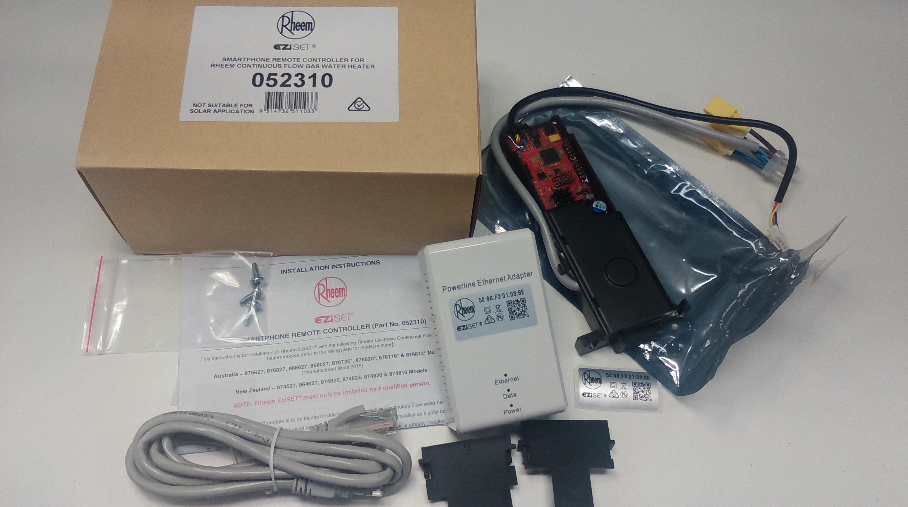

# Hardware

Note: The information on this page is incomplete. The author has not disassembled his unit to further investigate what his limited investigations have revealed.

## Use Case

According to information on Rheem's own website, this unit can be used on:

- Rheem 12L (876812)
- Rheem Metro 16L (876T16)
- Rheem 20L (876820)
- Rheem Metro 26L (876T26)
- Rheem 27L (876627, 876027, 866627, 866027)

Rheem claims that the device is only suitable for Rheem 12L to 26L models manufactured since 2018.

*Although the author hasn't investigated the matter further, it is unclear why this unit is restricted to models built after 2018. The device emulates the functionality of common kitchen side and bathroom side controllers that have been available for many years. The author does note that the unit may not fit with the included mount inside older models. Certainly, the authors prior unit that was manufactured in 2009 did not have sufficient clearance to fit this device with the standard mount - that said, with some ingenuity the author is certain that this could be made to work (even if not specifically surpported by the vendor).*

## Kit



Pictured above is the contents which you should receive.

Clockwise from the top-left they are:
- Box (items unpacked from box)
- Control Module (this is installed inside your water heater)
- MAC Address sticker (this is applied to your water heater and is required to comply with ACMA)
- (Bottom) 2x installation brackets (read the installation instructions, you may need to use 0, 1 or 2 of these depending on your unit).
- (Middle) Powerline Unit
- (Bottom) Ethernet cable to connect to your switch/ router/ modem
- (Middle) Installation Instructions
- 3x Mounting Screws

## Powerline Unit


Based upon investigations, this unit appears to be purely passive. It communicates with the Control Module and passes that information through using ethernet (10/100T).

This information has been surmised because turning off power to the control module results in no response at all from the http server provided by this device.

Rheem Australia uses a specific MAC Address block it has acquired for the purposes of this unit - the following information is extracted from the IEEE MAC Assignments database:

``` { .text .no-copy }
50-98-F3   (hex)		Rheem Australia Pty Ltd
5098F3     (base 16)		Rheem Australia Pty Ltd
				1 Alan Street
				Rydalmere  NSW  2116
				AU
```

#### Update 28/1: Credits to jdymond

The powerline unit communicates over the electrical network in the house with the heater which should allow you to put it anywhere as long as it is on the same circuit. This is similar to the Ethernet-over-Power type networking gear available from TP-Link, DLink, etc. There may be connectivity issues in some scenarios though:

* on a house with 3-phase power, putting the heater and powerline unit on different phases wont work (physically separated power lines).

* the heater and powerline unit on the same phase but different circuits in the house. The signal degrades heavily when passing over circuit breakers and/ or protection devices (e.g. UPS or solar battery)

* you are already using an Ethernet over Power type networking device which is interfering with this signal.

The ideal setup is having the heater and powerline adapter on the same circuit if possible with no power filters in between.


## Control Module


This device is installed inside the water heater unit. 

The white set of 2 cables piggy backs on low voltage the power supply to the water heater control circuitry.

The black set of cables plugs into the water temperature input/output that is used by Rheem's normal temperature setting devices.

This control module also operates the webserver which is used to control the temperature of the water heater.