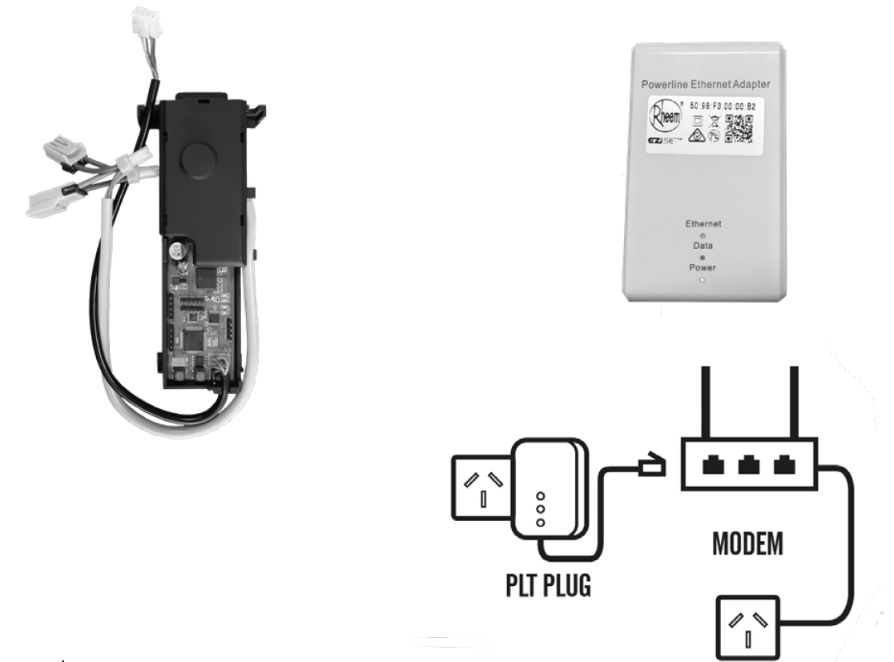

# Unofficial Rheem Eziset Protocol Documentation

These pages seek to document the Rheem Eziset Protocol. 

The Rheem Eziset is a device used to control the hotwater temperatures of certain Rheem Hot Water Systems. This device appears to be a local variant only available in Australia for now.

The device is made available to trades via trade wholesalers. Residential customers may purchase these devices from plumbing wholesalers by *implying* that they are a tradesman and quoting the following Rheem Product/ Part Code: `052310`. The trade price is around AU$300 but your results may vary.

Please note that while Rheem officially calls this device the Rheem EZiSET Kit - wholesalers have listed this device under various other names. The author purchased this device under the `Rheem Smartec Communicator` name.

Disclaimer: The author has no affiliation with Rheem Australia Pty Ltd or any other of its group companies. The information on this website has been obtained by packet sniffing and reverse engineering only and, accordingly, may not be accurate. No representation or warranty is given that the information contained on this website is official or correct. Use the information on this website at your own risk.

Copyright Notice: Unless otherwise stated, images used on this website belong to Rheem Australia Pty Ltd. They are used on this website on the basis of fair use and to the limited extent required to document the protocol used by the Rheem Eziset system.

Rheem and EZiSET are trademarks of Rheem Australia Pty Ltd. These trademarks are used on these pages under fair use and no affiliation or association with Rheem Australia Pty Ltd or any of its group companies is intended or to be inferred by the use of these marks.
